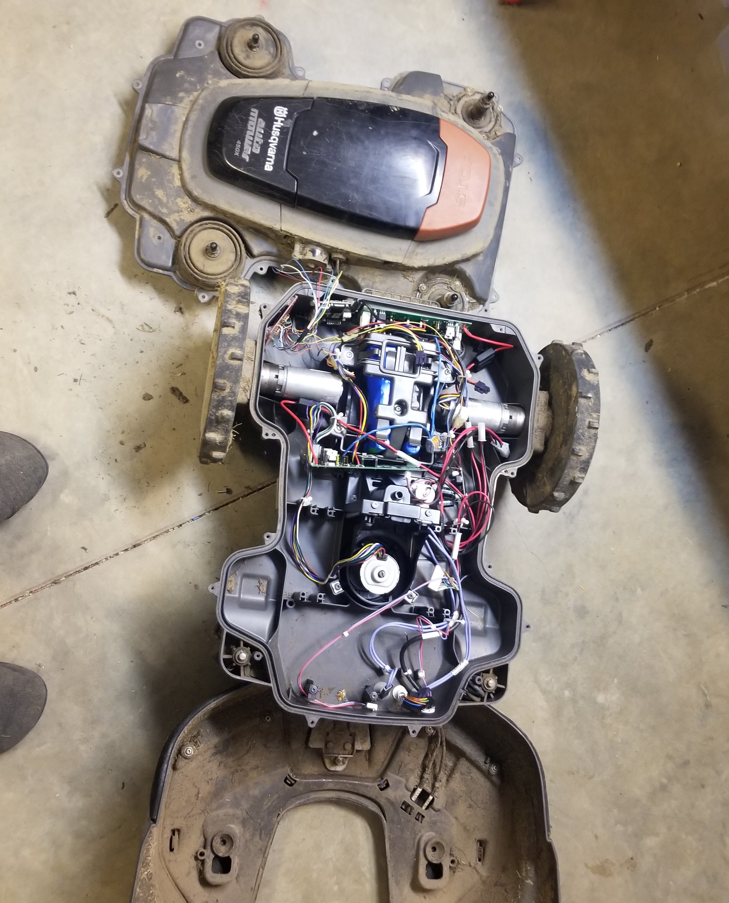

# SimpleMower
The best part is no part: Start with an older automower, then throw out all the original boards, software, and boundary wire. Keep the sensors, motors, and body. Add RTK GPS. Replace closed-source & under-functional software with a simple and easy to follow control loop in a single (1000 lines or less!) python file. No husqvarna-dealer-only tools. No ROS. No app. No boundary wire. Minimal complexity. Run it on anything that runs linux, python, and javascript. Interface from any computer browser. SimpleMower(ours is named Toby) has about 400 hours of mowing so far. I hope this helps level up your mower or robot! 

**Mower Mechanical:**
  - Husqvarna 450x automower. Mechanically they are pretty reliable. Dump the circuit boards and proprietary garbage but keep the sensors, motors, shell, battery, and cutting hardware.
  - Automower drive motor PM: Now is a good time to regrease your 450 drive motor gearboxes and check drive motor internals too. See setup instuctions for details.
  - Pretty sure most of this will work on a 430.

**Mower Electrical:**
  - Use husqvarna battery + sensors + motors. Add BBBlue, RTK Gps, wiring harness, and servo amps.
  - Battery: use the two husqvarna batteries from your 450 automower. They include a 5s balance charger under the blue wrapper.
  - Use a DC current limited power supply for charging. I cap charger at 4 Amps - about 2A/battery, but still under the 5A / battery limit if one of the two batteries failed.
  - Brains + sensors + low power: You could use anything that has: headless linux, wifi, 1x usb port(gps), 2x serial ports for servo amps (or 2x more usb ports), some sort of magnetometer, adc, and at least 5x digital inputs you can read with python, and some way to make 3.3v for hall sensors and servo amp rp2040's. BeagleBone Blue includes ALL of this on a single board that has cloud9 ide (easy browser ide no more ssh or clunky uploading - edit the code right on the mower then run it!) and has been reliable so far. The beaglebone takes 12v and makes 5v and 3.3v for the RP2040 picos on the servo amps, as well as sensor power. Soldered breadboard to break out the BBBlue digital inputs, and pull them up or down/ provide power to the hall-effect bump and lifted sensors.
  - Servo amp: Made our own: https://github.com/AmericanRework/Pico-2x-BLDC. Probably can use most simplefoc commander serial interface servo amps with minor modifications to code. Larger modifications to code and or electrical required for other serial or i2c/spi/etc controlled servo amps. If circuit board design is not your thing, Odrives are off the shelf and would certainly work but would need various code changes. We use a simple heartbeat: if the servo amp doesn't hear anything from the beaglebone for 5 sec it shuts off.
  - Sparkfun RTK GPS to BBBlue usb port. (https://www.sparkfun.com/products/18292) 
  - See ElectricalDoc.jpg for pinouts of the automower battery and sensors. 

**Mower Sensors:**
  - RTK GPS: SEMU consulting are my hero. (https://github.com/semuconsulting) We use two of their libraries, but you might also use their open source linux GUI for just testing out the ZED-F9P hardware at first.
  - Bump, lifted, and estop are all from the automower. They are hall effect sensors. See the red and white bump sensor pictures for board pinouts or the electrical doc for plug pinouts. Steal the plugs from your automower mainboard using a heat gun. Hot glue backside of the stolen connectors after you solder them up.
  - Temp, magnetometer, (accelerometer present but not used) and battery level are done by BBBlue. Battery level is a resistor voltage divider to the BBBlue ADC.

**RTK Base station:**
  - Beaglebone Black + Sparkfun RTK GPS kit + SEMU Consulting again.

**Mower Software:**
  -  Remote control from your browser. Hit the IP address of the Beaglebone Blue, get a remote control interface. No camera on the mower but you could probably add that.
  - Yes you can restart it remotely. Look at mower out your window, see it's good, read error message on remote webpage, restart or take appropriate action.
  - Mows rectangles that are aligned with gps latitude and longitude. I have 4 obstacle free rectangular zones that comprise about 70% of the yard. Yes you still have to get out a manual mower for the edges. You're not going to like whatever algorithm I come up with for mowing your lawn so write that part yourself - it's the fun part! (though if you wait long enough I'll post my solution)
  - Robot doesn't yet know how to find a charger, follow a vector, mow a pattern, mow non-rectangular shapes, have exclusion areas, back up after bonking into something, slow down near an edge/etc... Working on it, will update once I'm happy with it.

**Thank you!:**
  - SEMU Consulting: https://github.com/semuconsulting
  - Ublox: https://www.u-blox.com/en/product/zed-f9p-module
  - Sparkfun: https://www.sparkfun.com/products/15136
  - Beaglebone: https://www.beagleboard.org/boards/beaglebone-blue
  - RTK2go: http://rtk2go.com/

**Random notes:**
  - Our mower is named Toby. All references to 'toby' could presumably be changed to 'robot' but people take better care of robots if they name them!
  - This is very rough. Could easily tighten things up and delete all the prints and comments and put everything in a few function calls but that makes it harder for you to change. Give me a thousand lines in a couple files any day over hundreds of files all with five lines in them. 

**To fix:**
  - Temperature and battery voltage. High temps will run battery down too far, low temps below 30f cause a fault. (why are you mowing when it's that cold? -eh frosty mornings are cold.) At any rate, there's a high temp check above ~95f ambient to shut down mower - when it's 95 out in the sun I've seen the mower passing 120f. Too hot for 18650's to charge.
  - fault message on web interface is almost always 'mower is stuck' regardless of fault. Log file has correct faults, but when the mower stops moving 'cause it's faulted it decides it's also stuck, which generates a new error message. Fix.
  - Dump ALL power and shutdown when battery gets low. Right now, it stops mowing but still keeps the bbblue and dc-dc on, which pulls 0.2A which will eventually wreck your battery if you don't leave it on a charger.
  - Draw a diagram of how the three threads that run the mower interact.
  - Make the lights work. Really hard to drive at night without lights. BBB has drivers that should be able to run the LED lights of an automower.
  - Add in follow vector/mow non-rectangluar area/find charger/mow pattern/exclusion areas/backup after bump/slow down near edge.
  - If you disable the servo amps - hit estop/bumper/spacebar - then tell robot to drive in opposite direction, it'll resume travel in whatever direction it was going for a fraction of a second until the servo amp ramps up/down to the new desired velocity. Usually a tad bit of wrong-direction wheelspin is the symptom. This is a servo amp bug and we'll dig into it eventually but probably after other problems.
  - Current feedback from drive motor servo amp isn't quite right. Suspect code issue in servo amp. works well enough to shut down but we should calibrate it to return at least roughly the # of amps not ~50x # of amps. heh.
  - Write some better 'how to drive' instructions.
  - Smart phones don't generate keypress events. Right now you have to use a pc for remote control. Would be nice to have some way to get a phone-browser interface even if it's just some buttons for start/reset/etc...
